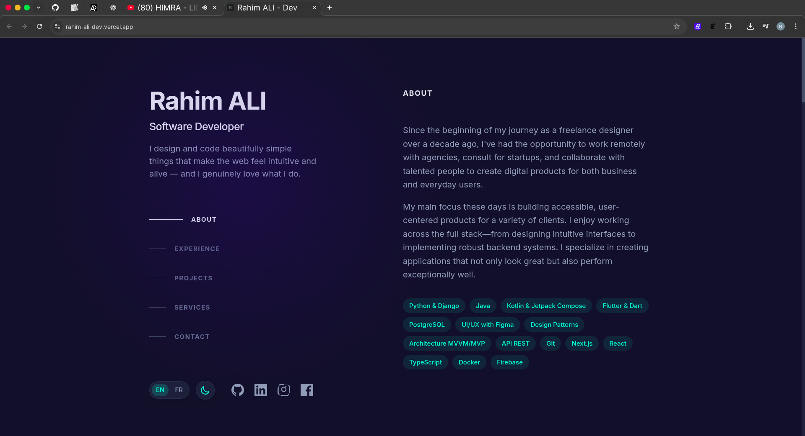

# 🚀 Website - Rahim ALI

Portfolio personnel moderne et interactif construit avec Next.js 15, React 19, TypeScript et Tailwind CSS.




## 🛠️ Technologies

- **Framework** : Next.js 15.5.5 (App Router)
- **UI Library** : React 19.1.0
- **Language** : TypeScript 5.x
- **Styling** : Tailwind CSS 4.x
- **Fonts** : Inter (Google Fonts)
- **Icons** : SVG personnalisés
- **Deployment** : Vercel / Netlify

## 📦 Installation

### Prérequis
- Node.js >= 18.x
- npm ou yarn

### Commandes

```bash
# Cloner le repository
git clone https://github.com/votre-username/portfolio.git
cd portfolio

# Installer les dépendances
npm install

# Lancer en développement
npm run dev

# Build pour la production
npm run build

# Lancer en production
npm start

# Linter
npm run lint
```


### Langues Disponibles
- 🇬🇧 Anglais (par défaut)
- 🇫🇷 Français


### Thèmes Disponibles
- 🌙 Dark Mode (slate + teal)
- ☀️ Light Mode (crème + teal foncé)

## 🙏 Crédits

- **Design Inspiration** : [Brittany Chiang](https://brittanychiang.com/)
- **Framework** : [Next.js](https://nextjs.org/)
- **Styling** : [Tailwind CSS](https://tailwindcss.com/)

## 📞 Contact

- **Email** : rahim100codeur@gmail.com
- **LinkedIn** : [Rahim ALI](http://www.linkedin.com/in/rahim-ali-a6003226b)
- **GitHub** : [Rahim10020](https://github.com/Rahim10020)

---

Fait avec ❤️ par Rahim ALI